<h1 style="text-align: center;">CASOS DE USO</h1>

### Caso de Uso: Registro de Usuario 

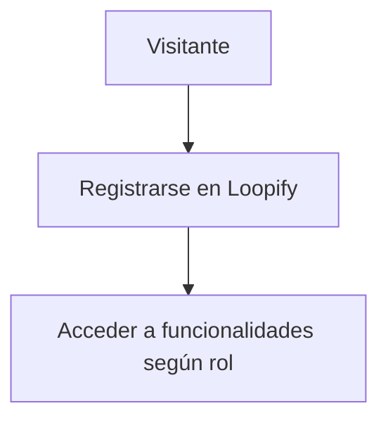

### Diagrama de Secuencia: Acceso al Formulario de Registro

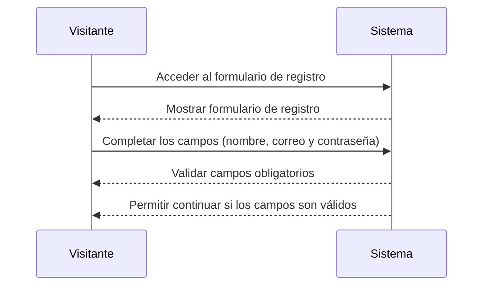

### Diagrama de Secuencia: Asignación de Rol de Cliente

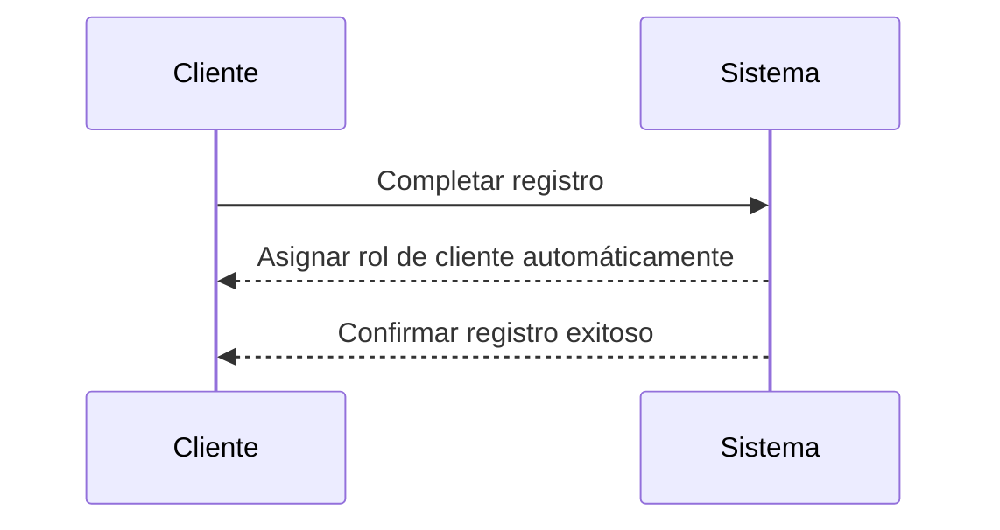

### Diagrama de Secuencia: Creación de Cuenta por Administrador

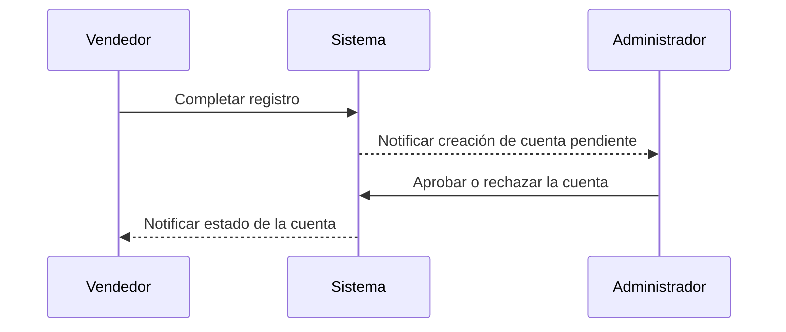

### Diagrama de Secuencia: Validación de Correo Único

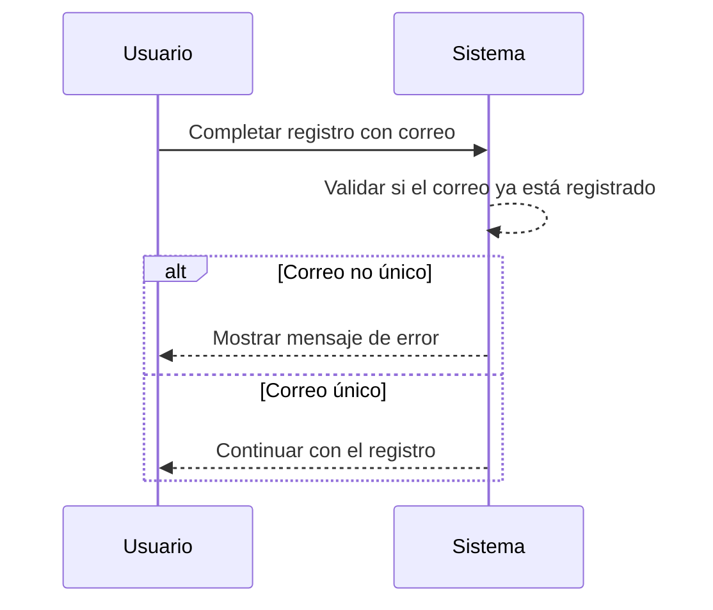

### Diagrama de Secuencia: Mensaje de Confirmación de Registro

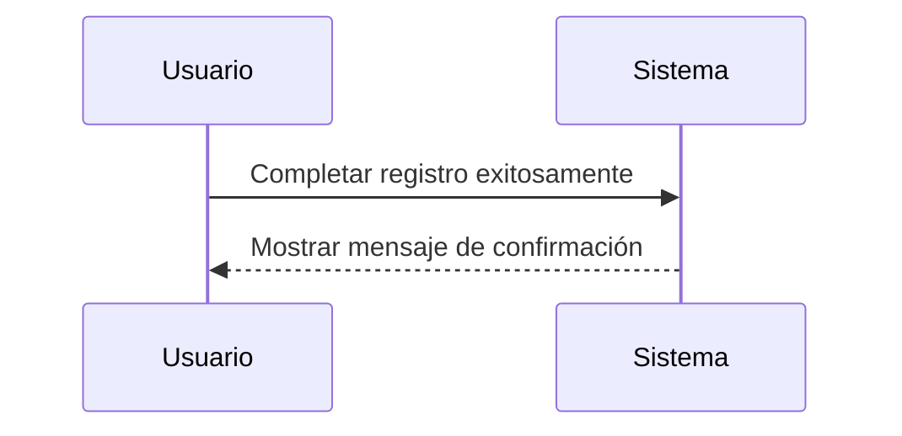

### Diagrama de Secuencia: Tiempo de Carga del Formulario

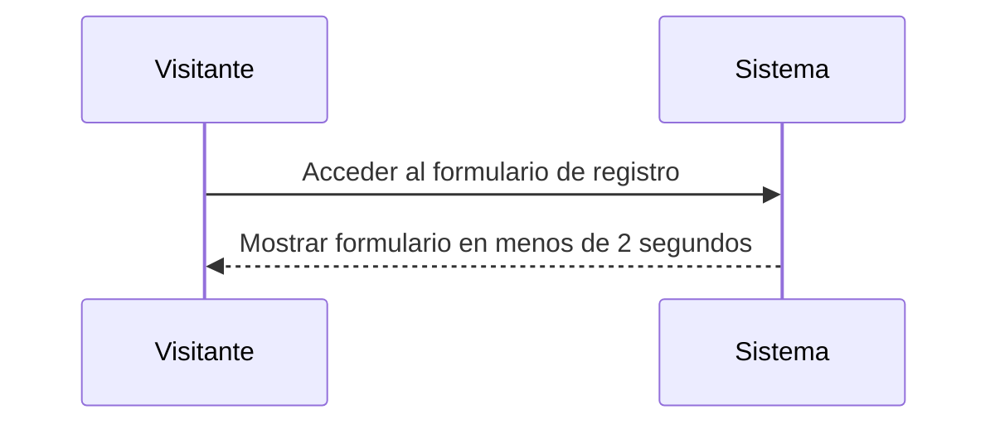

### Diagrama de Secuencia: Cifrado de Contraseña

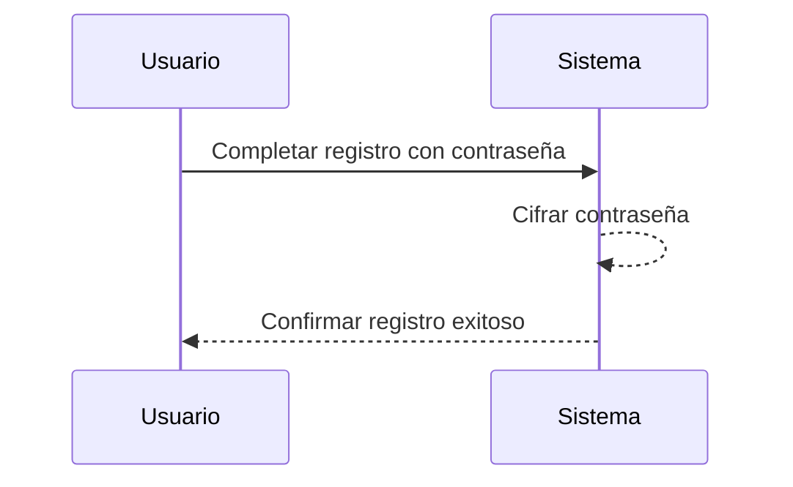


### Caso de Uso: Inicio de Sesion 

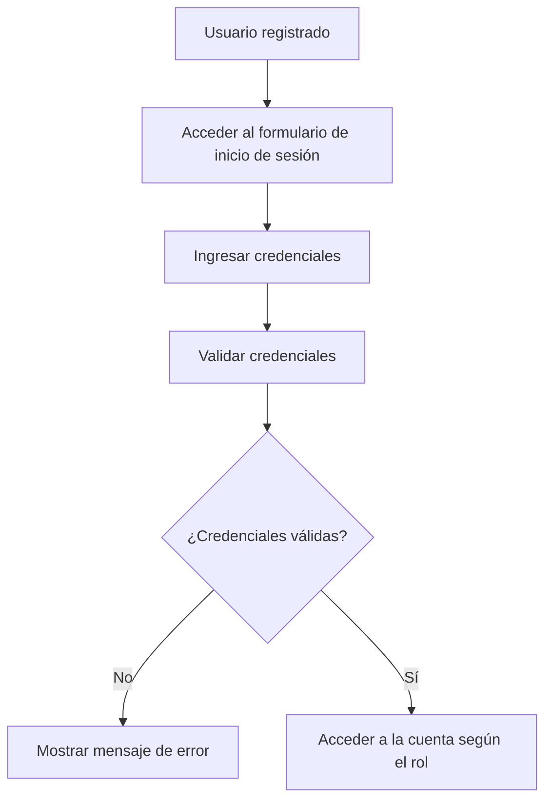

### Diagrama de Secuencia: Campos de Inicio de Sesión

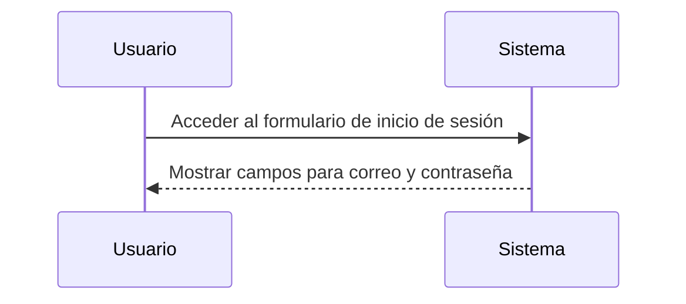

### Diagrama de Secuencia: Mensaje de Error por Credenciales Incorrectas

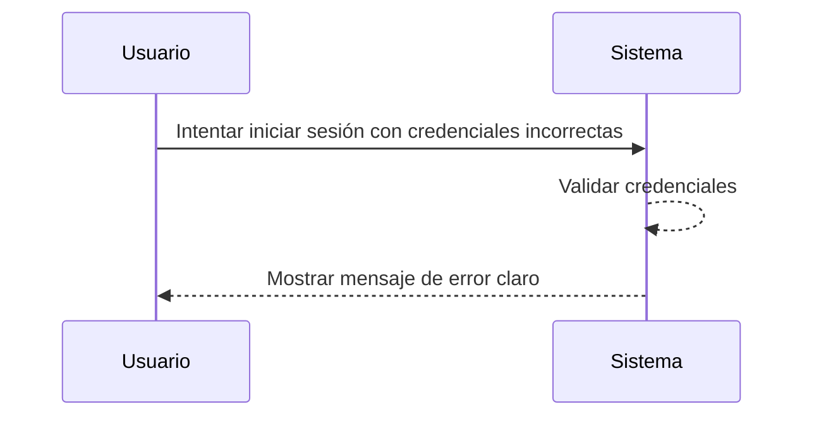

### Diagrama de Secuencia: Redirección según Rol

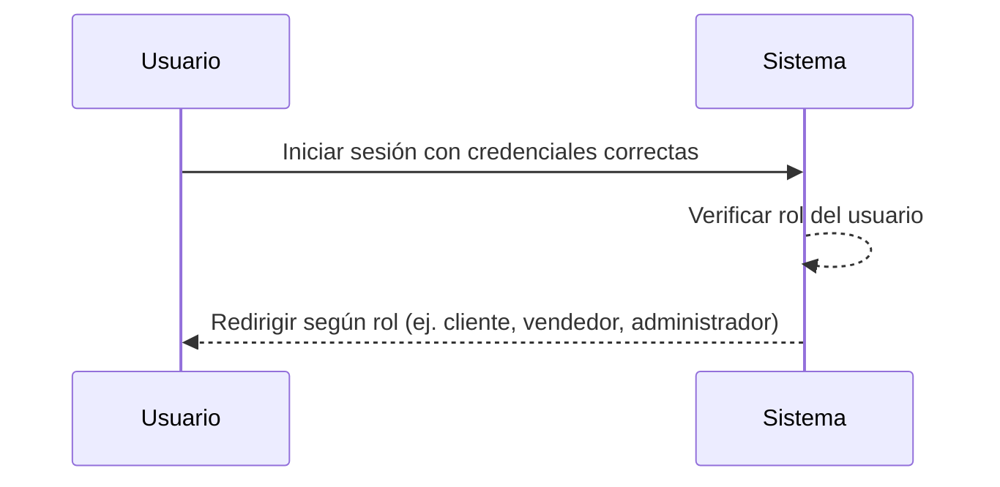

### Diagrama de Secuencia: Redirección para Administrador

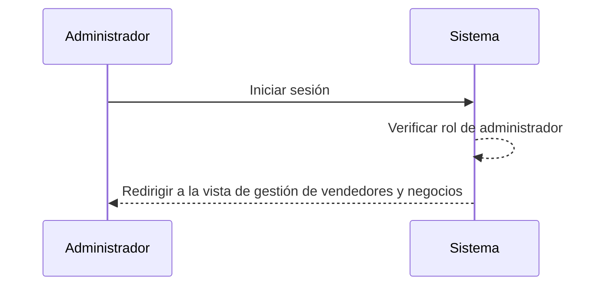

### Diagrama de Secuencia: Recuperación de Contraseña

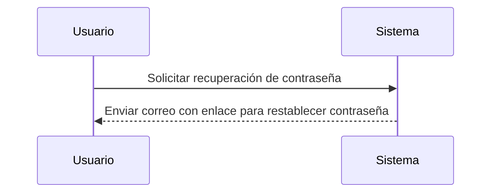

### Diagrama de Secuencia: Inicio de Sesión en Menos de 3 Segundos

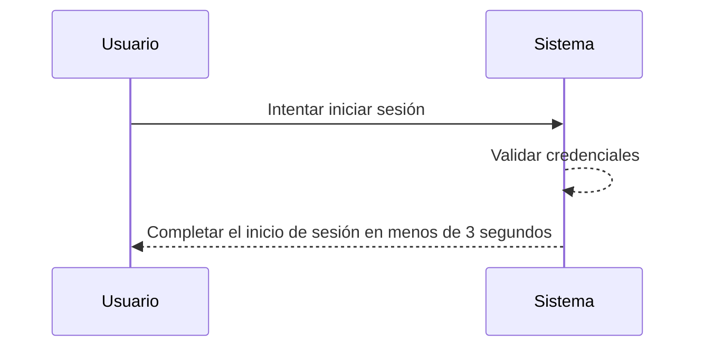

### Diagrama de Secuencia: Expiración de Sesión por Inactividad

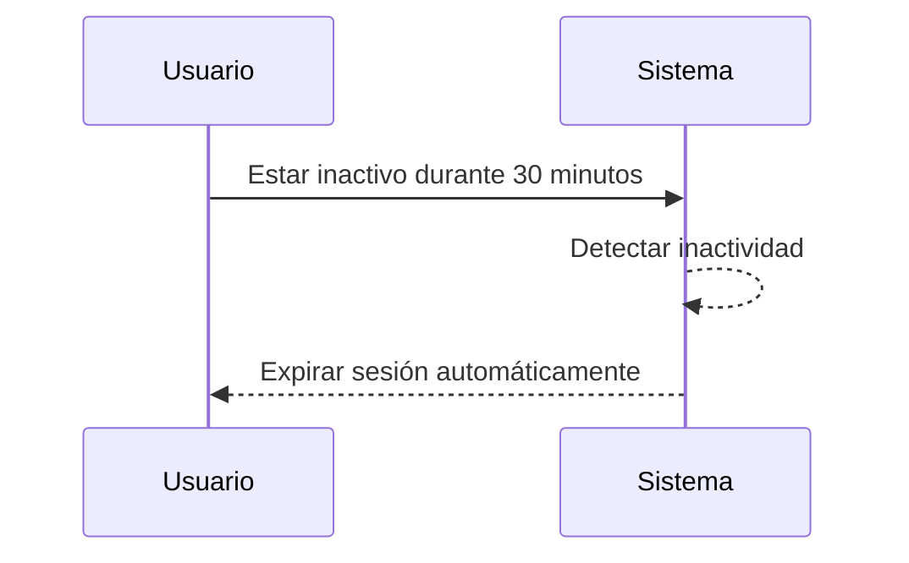

### Caso de Uso: Gestion de Vendedores 

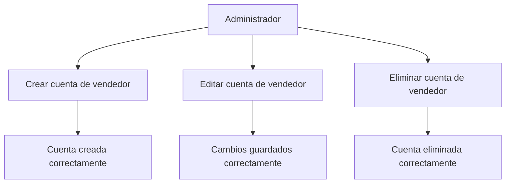

### Caso de Uso: Gestión de negocios

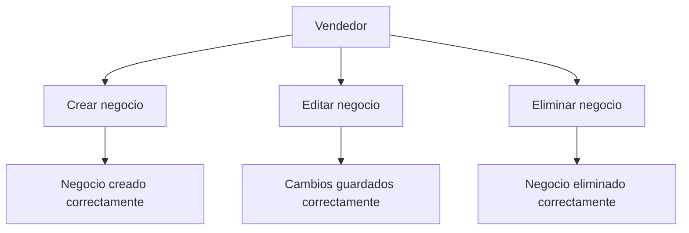

### Caso de Uso: Publicación de productos

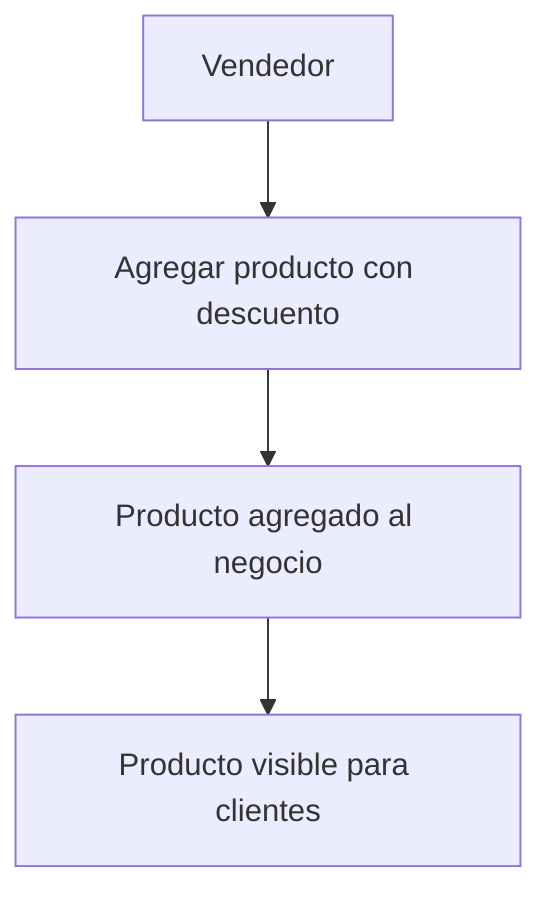

### Caso de Uso: Recuperacion de contraseña 

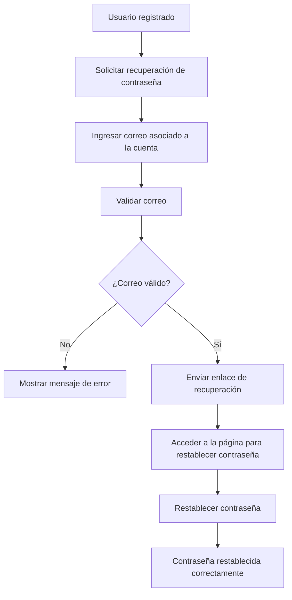

### Caso de Uso: Visualizacion de Negocios

```mermaid
graph TB
    A[Cliente] --> B[Ver lista de negocios disponibles]
    B --> C[Explorar los productos del negocio]
```

### Caso de Uso: Compra de Productos 

```mermaid
graph TB
    A[Cliente] --> B[Seleccionar producto]
    B --> C[Agregar producto al carrito de compras]
    C --> D[Producto agregado correctamente]
    D --> E[Visualizar carrito de compras]
```

### Caso de Uso: Reportes 

```mermaid
graph TB
    A[Administrador] --> B[Generar reporte de ventas]
    A --> C[Generar reporte de productos]
    B --> D[Reporte de ventas generado]
    C --> E[Reporte de productos generado]
    D --> F[Evaluar rendimiento de la plataforma]
    E --> F
```

### Caso de Uso: Notificaciones 

```mermaid
graph TB
    A[Cliente] --> B[Suscribirse a notificaciones]
    B --> C[Recibir notificación de nuevos productos]
    C --> D[Ver detalles del producto]
    D --> E[Aprovechar ofertas antes de que se agoten]
```


