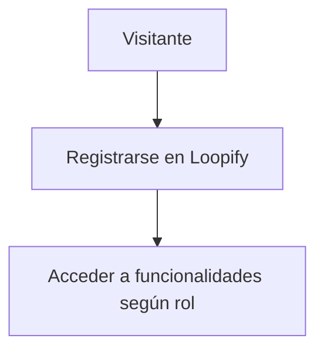
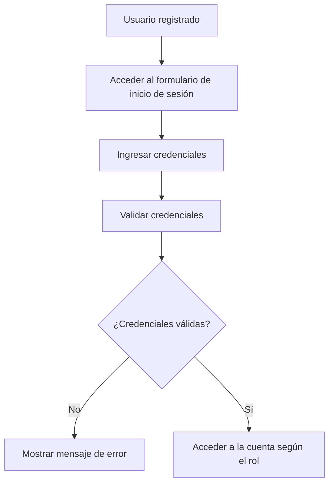
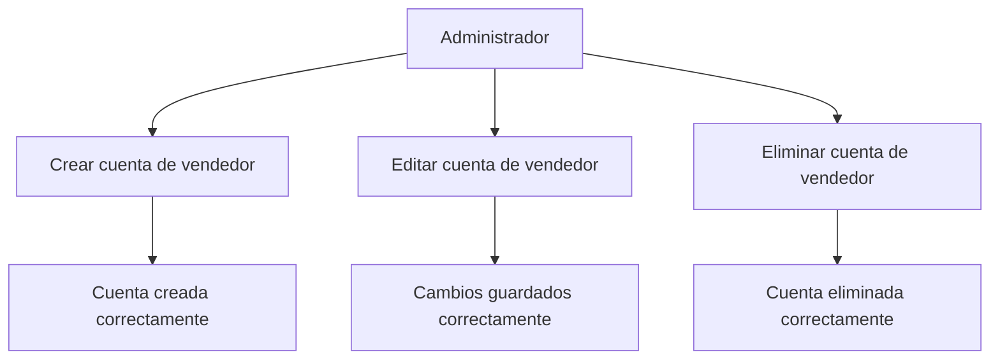
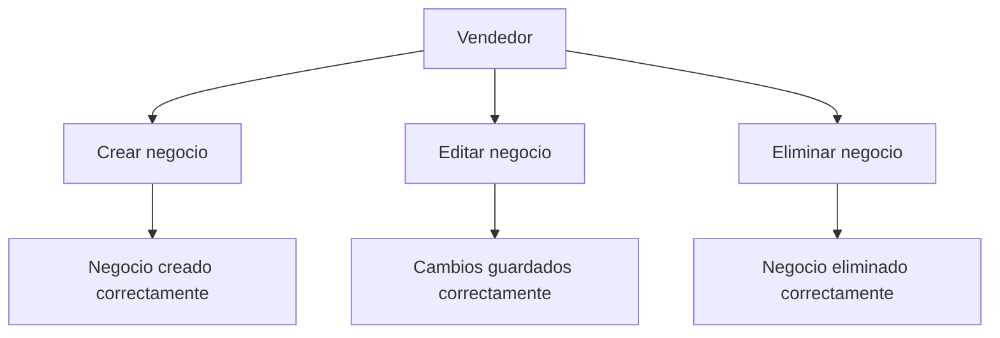
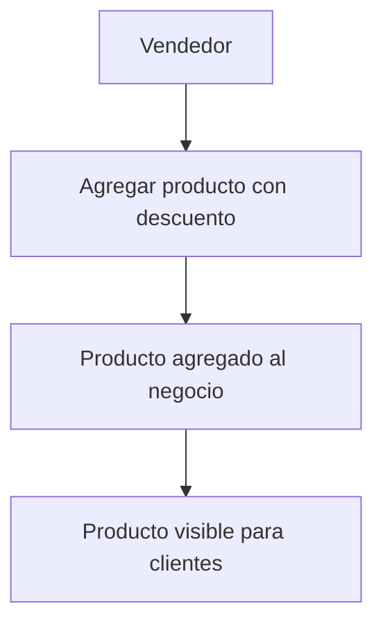
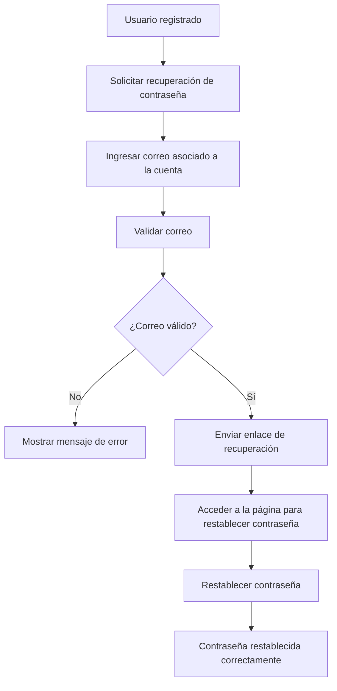
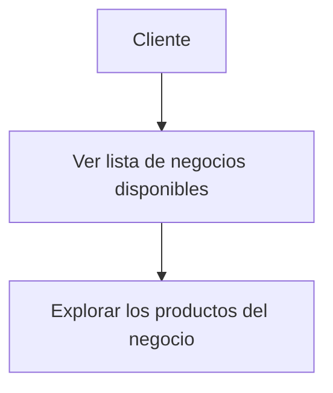
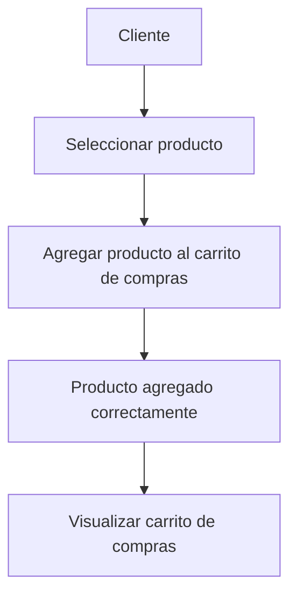
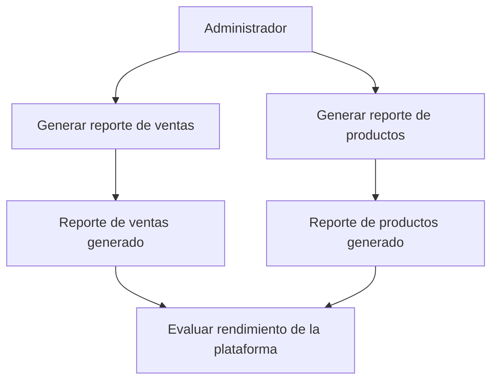
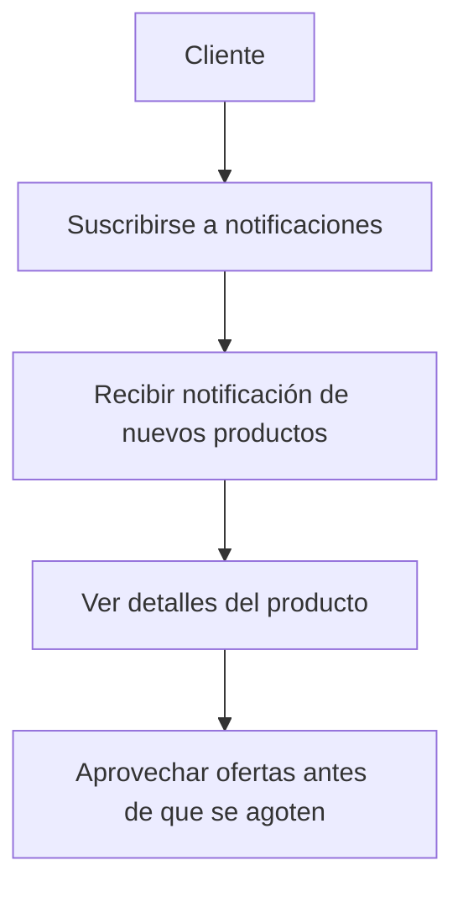

### Caso de Uso: Registro de Usuario 

### Caso de Uso: Inicio de Sesion 

### Caso de Uso: Gestion de Vendedores 

### Caso de Uso: Gestión de negocios

### Caso de Uso: Publicación de productos

### Caso de Uso: Recuperacion de contraseña 

### Caso de Uso: Visualizacion de Negocios

### Caso de Uso: Compra de Productos 

### Caso de Uso: Reportes 

### Caso de Uso: Notificaciones 

