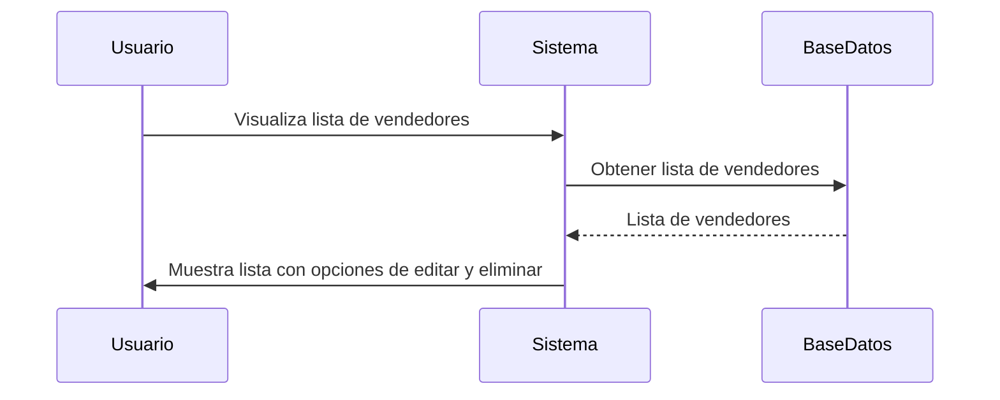
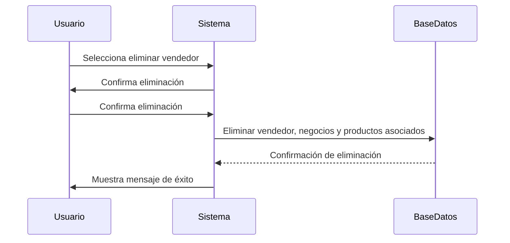
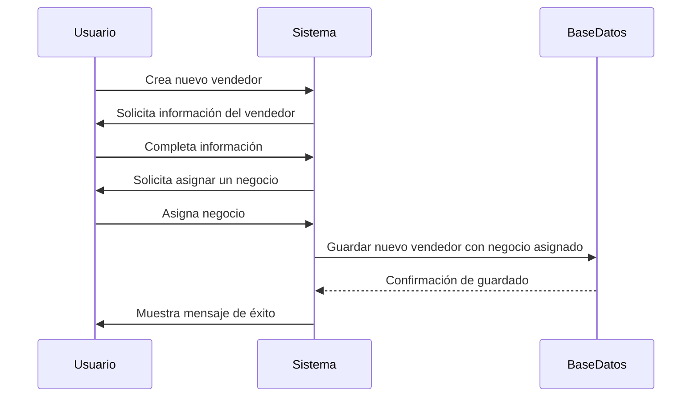

<h1 style="text-align: center;">CASOS DE USO</h1>

### Caso de Uso: Registro de Usuario 


### Diagrama de Secuencia: Acceso al Formulario de Registro


### Diagrama de Secuencia: Asignación de Rol de Cliente


### Diagrama de Secuencia: Creación de Cuenta por Administrador


### Diagrama de Secuencia: Validación de Correo Único


### Diagrama de Secuencia: Mensaje de Confirmación de Registro


### Diagrama de Secuencia: Tiempo de Carga del Formulario


### Diagrama de Secuencia: Cifrado de Contraseña


### Caso de Uso: Inicio de Sesion 


### Diagrama de Secuencia: Campos de Inicio de Sesión


### Diagrama de Secuencia: Mensaje de Error por Credenciales Incorrectas


### Diagrama de Secuencia: Redirección según Rol


### Diagrama de Secuencia: Redirección para Administrador


### Diagrama de Secuencia: Recuperación de Contraseña


### Diagrama de Secuencia: Inicio de Sesión en Menos de 3 Segundos


### Diagrama de Secuencia: Expiración de Sesión por Inactividad


### Caso de Uso: Gestion de Vendedores 


### Diagrama de secuencia: Opciones para editar y eliminar vendedores


### Diagrama de secuencia: Eliminar un vendedor y sus negocios y productos


### Diagrama de secuencia: Asignar un negocio al vendedor al crear uno nuevo


### Diagrama de secuencia: Validación de datos al registrar o actualizar vendedor
```mermaid
sequenceDiagram
    participant Usuario
    participant Sistema
    participant BaseDatos

    Usuario->>Sistema: Intenta guardar vendedor
    Sistema->>Sistema: Valida datos (nombre, correo, teléfono)
    Sistema-->>Usuario: Datos válidos
    Sistema->>BaseDatos: Guardar datos del vendedor
    BaseDatos-->>Sistema: Confirmación de guardado
    Sistema->>Usuario: Muestra mensaje de éxito
    Sistema-->>Usuario: Muestra mensaje de error si los datos no son válidos
```

### Diagrama de secuencia: Vendedor eliminado no aparece en la lista
```mermaid
sequenceDiagram
    participant Usuario
    participant Sistema
    participant BaseDatos

    Usuario->>Sistema: Visualiza lista de vendedores
    Sistema->>BaseDatos: Obtener lista de vendedores
    BaseDatos-->>Sistema: Lista de vendedores (sin el eliminado)
    Sistema->>Usuario: Muestra lista actualizada
```

### Diagrama de secuencia: Buscar vendedor específico por nombre o correo
```mermaid
sequenceDiagram
    participant Usuario
    participant Sistema
    participant BaseDatos

    Usuario->>Sistema: Inicia búsqueda por nombre o correo
    Sistema->>BaseDatos: Buscar vendedor por nombre o correo
    BaseDatos-->>Sistema: Resultados de búsqueda
    Sistema->>Usuario: Muestra resultados de búsqueda
```

### Diagrama de secuencia: Reflejo en tiempo real de cambios en la lista de vendedores
```mermaid
sequenceDiagram
    participant Usuario
    participant Sistema
    participant BaseDatos

    Usuario->>Sistema: Realiza cambio (crear, editar o eliminar vendedor)
    Sistema->>BaseDatos: Confirma cambio en la base de datos
    BaseDatos-->>Sistema: Confirmación de cambio
    Sistema->>Usuario: Muestra lista de vendedores actualizada en menos de 5 segundos
```

### Caso de Uso: Gestión de negocios

```mermaid
graph TB
    A[Vendedor] --> B[Crear negocio]
    A --> C[Editar negocio]
    A --> D[Eliminar negocio]
    B --> E[Negocio creado correctamente]
    C --> F[Cambios guardados correctamente]
    D --> G[Negocio eliminado correctamente]
```

### Caso de Uso: Publicación de productos

```mermaid
graph TB
    A[Vendedor] --> B[Agregar producto con descuento]
    B --> C[Producto agregado al negocio]
    C --> D[Producto visible para clientes]
```

### Caso de Uso: Recuperacion de contraseña 

```mermaid
graph TB
    A[Usuario registrado] --> B[Solicitar recuperación de contraseña]
    B --> C[Ingresar correo asociado a la cuenta]
    C --> D[Validar correo]
    D --> E{¿Correo válido?}
    E -- No --> F[Mostrar mensaje de error]
    E -- Sí --> G[Enviar enlace de recuperación]
    G --> H[Acceder a la página para restablecer contraseña]
    H --> I[Restablecer contraseña]
    I --> J[Contraseña restablecida correctamente]
```

### Caso de Uso: Visualizacion de Negocios

```mermaid
graph TB
    A[Cliente] --> B[Ver lista de negocios disponibles]
    B --> C[Explorar los productos del negocio]
```

### Caso de Uso: Compra de Productos 

```mermaid
graph TB
    A[Cliente] --> B[Seleccionar producto]
    B --> C[Agregar producto al carrito de compras]
    C --> D[Producto agregado correctamente]
    D --> E[Visualizar carrito de compras]
```

### Caso de Uso: Reportes 

```mermaid
graph TB
    A[Administrador] --> B[Generar reporte de ventas]
    A --> C[Generar reporte de productos]
    B --> D[Reporte de ventas generado]
    C --> E[Reporte de productos generado]
    D --> F[Evaluar rendimiento de la plataforma]
    E --> F
```

### Caso de Uso: Notificaciones 

```mermaid
graph TB
    A[Cliente] --> B[Suscribirse a notificaciones]
    B --> C[Recibir notificación de nuevos productos]
    C --> D[Ver detalles del producto]
    D --> E[Aprovechar ofertas antes de que se agoten]
```


